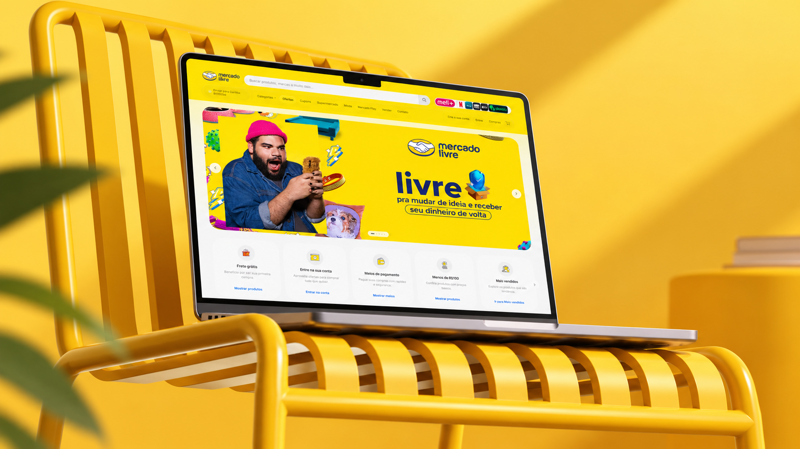
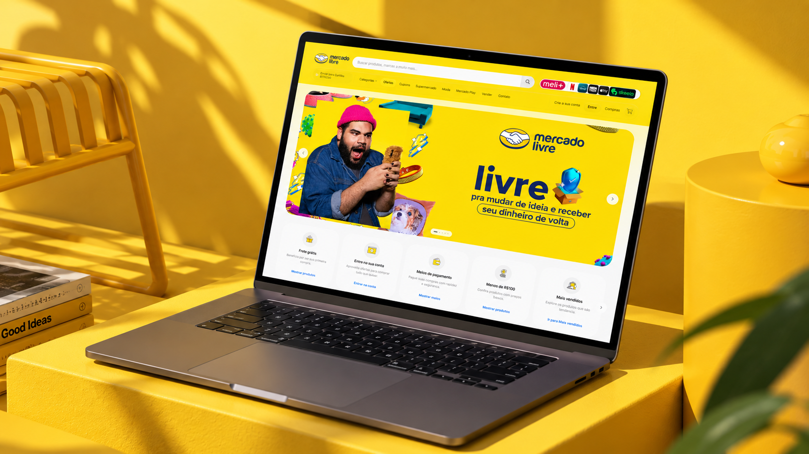

# Mercado Livre Redesign

A modern redesign concept exploring a new visual experience for Mercado Livre.

## About

This project is a personal redesign concept created to explore a more modern, visual and engaging shopping experience for Mercado Livre.

The concept focuses on interface design, visual hierarchy, interactions and the overall browsing experience.

## Preview

## Highlights

• Modern e-commerce interface  
• Responsive layout  
• Interactive elements  
• Product-focused visual hierarchy  
• Custom animations and transitions  
• Desktop and mobile experience

## Built With

HTML  
CSS  
JavaScript

## Live Experience

[View Live Project](https://mercado-livre-web.vercel.app/)

## Source Code

This repository is intended as a project showcase.

Only selected code samples are publicly available. The complete source code and implementation are kept private.

## Disclaimer

This is an independent conceptual project created for portfolio and educational purposes.

Mercado Livre and its trademarks belong to their respective owners. This project is not affiliated with or endorsed by Mercado Livre.

## Author

Victor Brandão

Software Developer  
Code, tech & digital products
